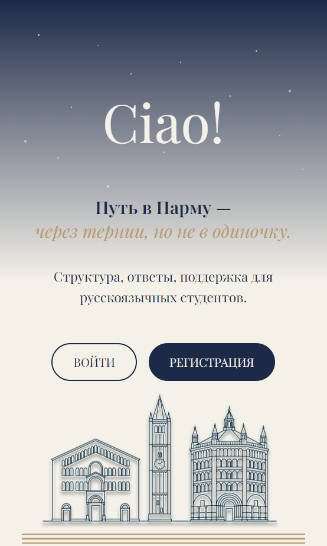
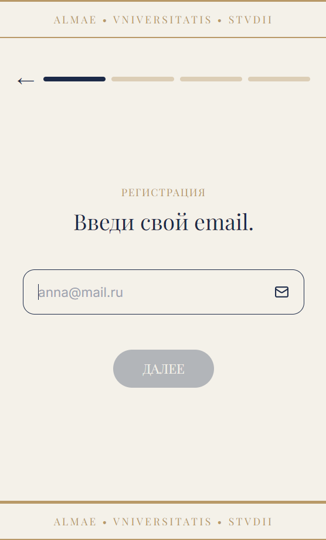
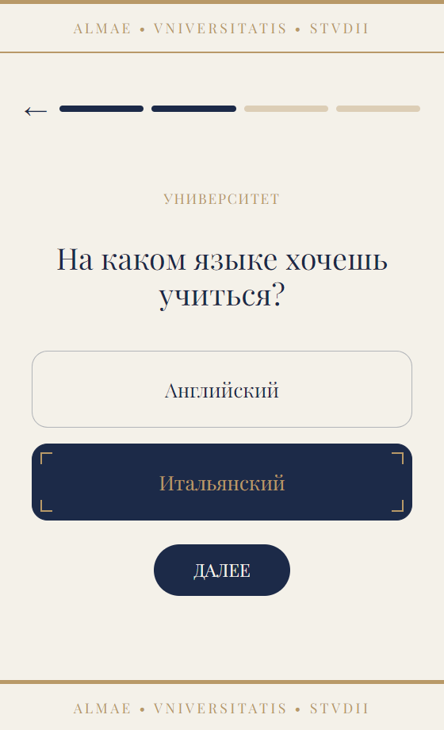
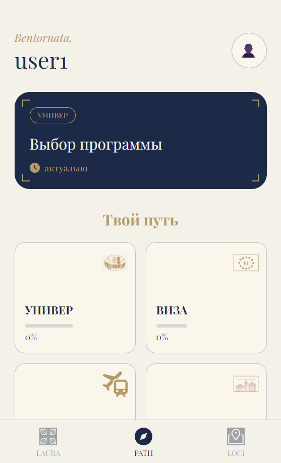
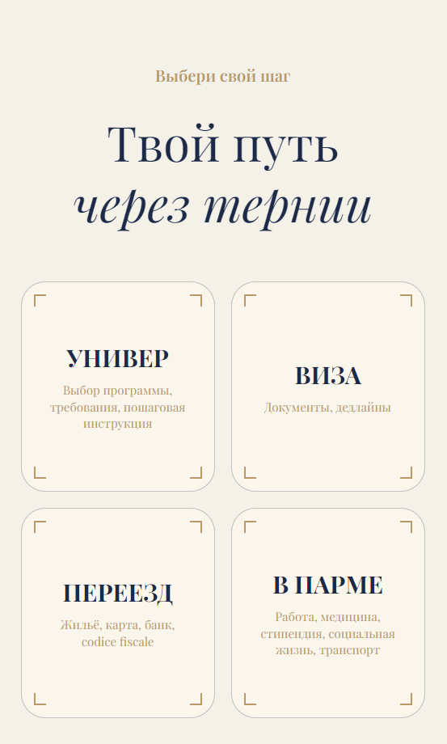
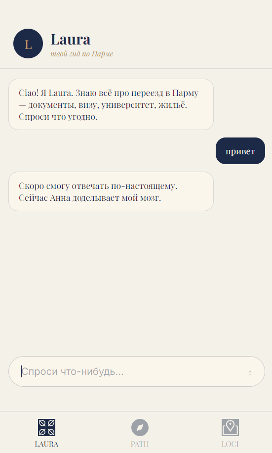
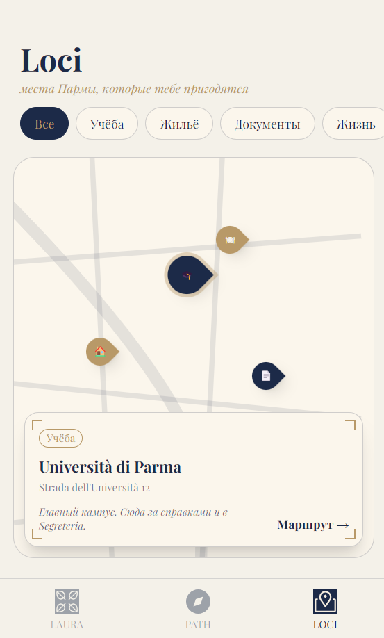

# CIS.PR — Onboarding app for international students in Parma


A mobile-first web app that guides Russian-speaking students from CIS countries through every step of enrolling at the Università di Parma — from choosing a degree programme to settling into the city. Built as a fully interactive prototype with real navigation, localStorage persistence, and a structured onboarding flow.

**[Live Demo →](https://cis-frontend-iig1.onrender.com)**

---

## Screenshots

| Welcome | Registration | Quiz |
|---------|-------------|------|
|  |  |  |

| Dashboard | Stage Picker | Laura (AI chat) | Loci (Map) |
|-----------|-------------|-----------------|-----------|
|  |  |  |  |

---

## About the project

**The problem:** Applying to an Italian university as a CIS student involves a maze of bureaucracy — entrance exams, visa types, document legalisation, housing deadlines, and culture shock. Most students navigate this alone, relying on scattered Telegram threads and outdated blogs.

**The solution:** CIS.PR turns the entire journey into a structured, step-by-step path. A short onboarding quiz personalises the dashboard so each student sees only the milestones relevant to their situation. Progress is saved locally so nothing is lost between sessions.

**Who it's for:** Russian-speaking bachelor's and master's applicants from Russia, Kazakhstan, Ukraine, and other CIS countries targeting Università di Parma.

---

## Features

- [x] Welcome screen, login, and multi-step registration flow
- [x] Stage picker — 4 life-cycle categories (apply, visa, move, settle)
- [x] 3 adaptive onboarding quizzes: University · Visa · Travel
- [x] Personalised dashboard with dynamic stage progress
- [x] Section pages with checkable steps and expandable substeps
- [x] Real-time budget tracker
- [x] AI chat placeholder — Laura (RAG integration planned)
- [x] Interactive map placeholder — Loci (Leaflet integration planned)
- [x] Settings page with profile editing
- [x] `localStorage` state persistence across sessions

---

## Tech stack

### Frontend
| Layer | Technology |
|-------|-----------|
| Framework | React 18 + TypeScript |
| Build | Vite 5 |
| Styling | Tailwind CSS 3 |
| Routing | React Router v6 |
| Icons | lucide-react |

### Testing
| Tool | Purpose |
|------|---------|
| Vitest | Unit & integration tests |
| React Testing Library | Component testing |

### Deploy
- **Render** — static site, auto-deploys from `main`

### Backend _(in progress)_
FastAPI · PostgreSQL · Supabase · Anthropic API

---

## Project structure

```
src/
├── assets/          # SVG icons and illustrations
├── components/      # Reusable UI components (TabBar, …)
├── lib/             # Utilities and future API client
├── pages/           # Route-level components
│   ├── WelcomePage.tsx
│   ├── LoginPage.tsx
│   ├── RegisterPage.tsx
│   ├── OnboardingPage.tsx
│   ├── ChangeStagePage.tsx
│   ├── ChoiceProgramPage.tsx
│   ├── PathPage.tsx
│   ├── SectionPage.tsx
│   ├── LauraPage.tsx
│   ├── MapPage.tsx
│   ├── QuizTravelPage.tsx
│   ├── QuizVisaPage.tsx
│   └── SettingsPage.tsx
├── types/           # TypeScript type definitions
├── App.tsx
└── main.tsx
```

---

## Running locally

Requires **Node.js 18+**.

```bash
git clone https://github.com/aicezhe/cispr-frontend.git
cd cispr-frontend
npm install
npm run dev
```

Open [http://localhost:5173](http://localhost:5173).

---

## Running tests

```bash
npm test
```

---

## Roadmap

- [ ] Backend integration — FastAPI + PostgreSQL
- [ ] Laura RAG chatbot — Anthropic API + pgvector
- [ ] Real Leaflet map with university and city points of interest
- [ ] Mobile native app — React Native
- [ ] Multi-language support (IT · EN · RU)

---

## Author

**Anna Zheleikina** — Management Engineering student, Università di Parma

[LinkedIn →](https://www.linkedin.com/in/anna-zheleikina-136094291/?locale=en) <!-- replace with your profile URL -->

---

## License

[MIT](./LICENSE)
