# CIS.PR Frontend

Frontend для CIS.PR, веб-приложения для русскоязычных студентов из СНГ в Университете Пармы.

## Tech Stack

- React + TypeScript
- Vite
- Tailwind CSS
- React Router

## Design

[Open in Figma](https://www.figma.com/design/JVjzBULODXS2dX6oOIBMsH/CIS-PR?node-id=1-2&t=g3SphMpDNVGJPXVi-1)

### Welcome screens

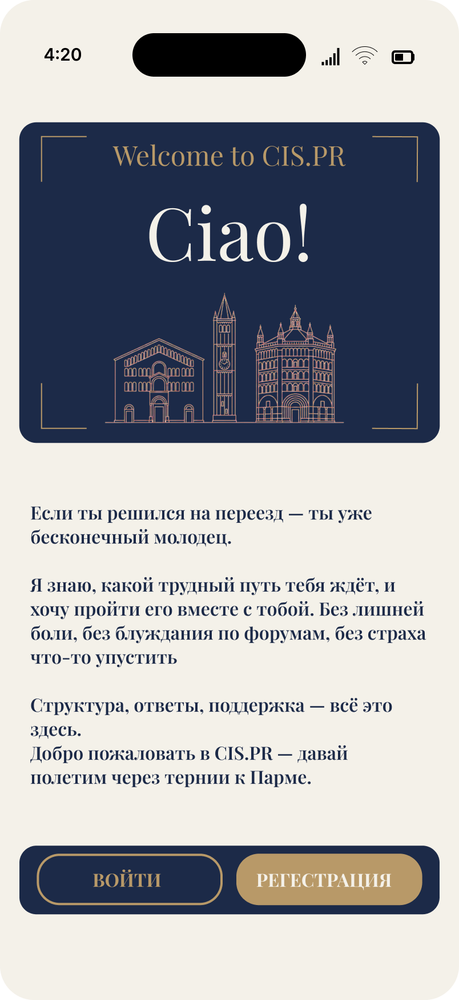
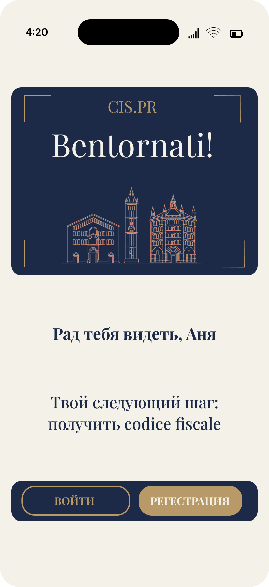
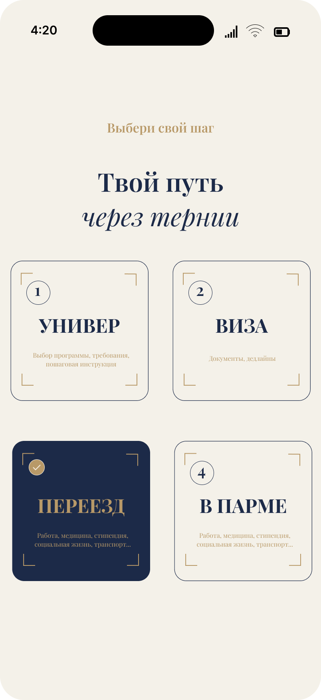

### Registration flow

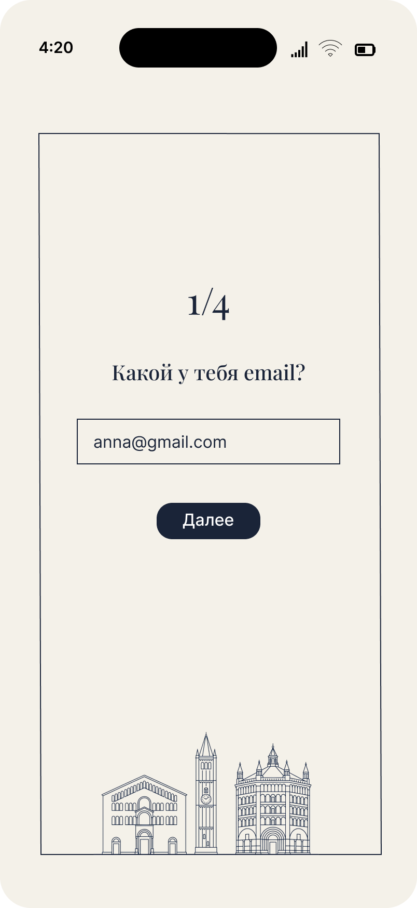
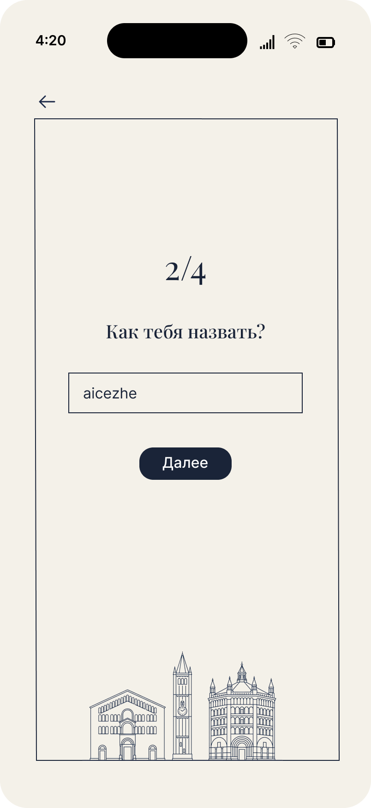
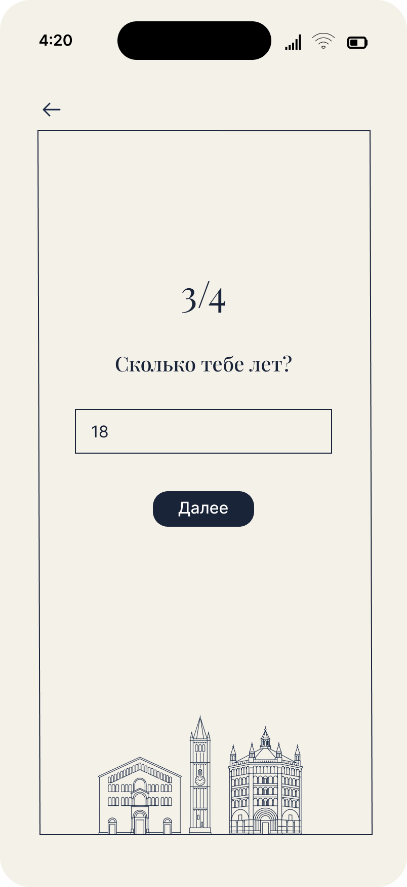
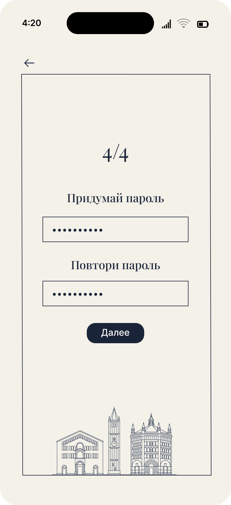

### Onboarding quiz: University

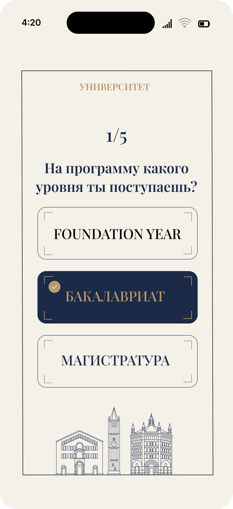
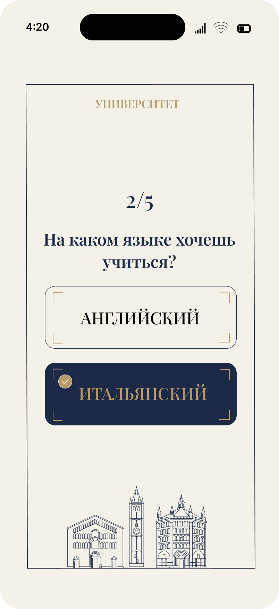
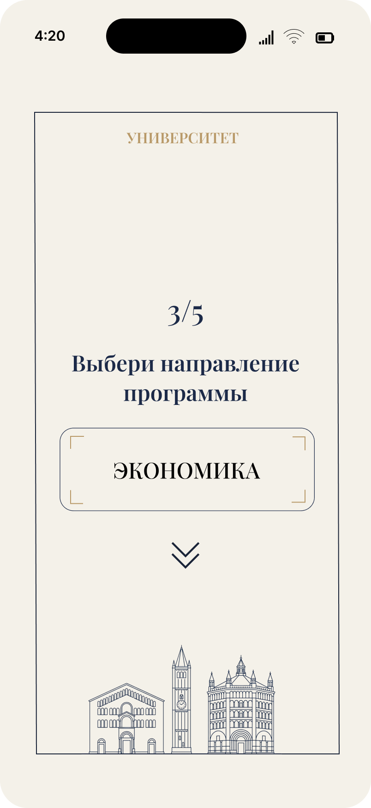
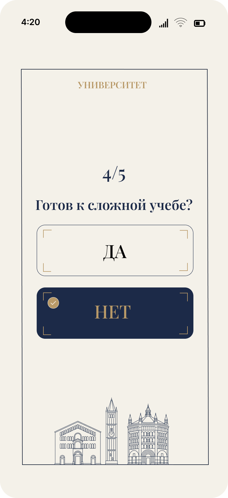

### Onboarding quiz: Visa

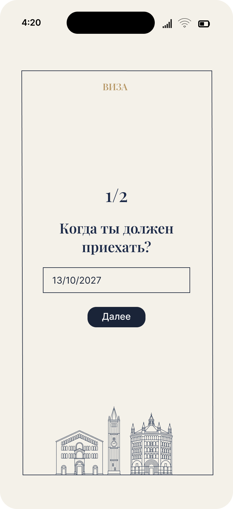

### Onboarding quiz: Travel

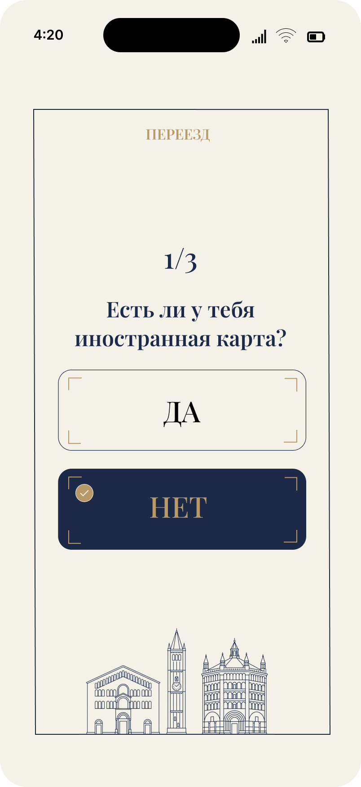
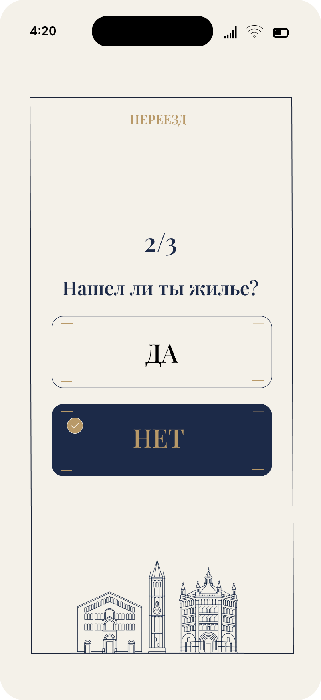
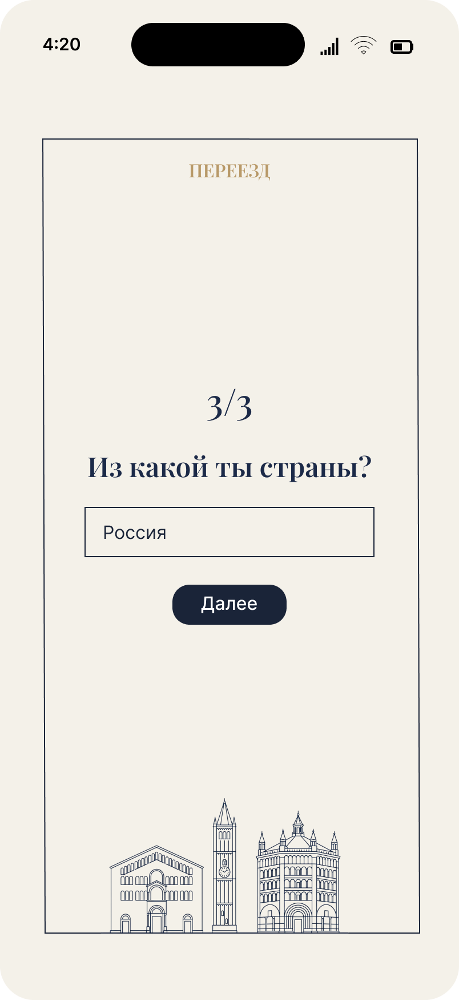

## Status

Готово:
- Welcome screens (3)
- Registration flow (4 screens)
- Onboarding quiz (10 screens: University, Visa, Travel)

В работе:
- Dashboard Your Way
- Laura chat
- Parma map
- Profile

## Project

CIS.PR, структурированный guide для русскоязычных студентов, поступающих или учащихся в Университете Пармы.

Построено сольно: product strategy, design, frontend code.